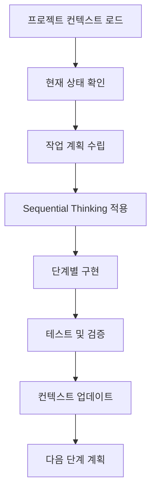

# MCP 기반 개발 워크플로우

## 개발 워크플로우 개요

### 일일 개발 프로세스


## Context7 기반 작업 체크리스트

### 새로운 기능 개발시
```markdown
□ Project Context
  - 기능이 프로젝트 목표에 부합하는가?
  - 전체 아키텍처와 일관성을 유지하는가?

□ Technical Context  
  - 기술 스택과 호환되는가?
  - 기존 컴포넌트를 재사용할 수 있는가?

□ Business Context
  - 사용자 가치를 제공하는가?
  - 비즈니스 요구사항을 만족하는가?

□ User Context
  - 사용자 경험이 향상되는가?
  - 접근성을 고려했는가?

□ Performance Context
  - 성능에 부정적 영향이 없는가?
  - 메모리 사용량을 고려했는가?

□ Security Context
  - 보안 취약점이 없는가?
  - 민감한 데이터를 안전하게 처리하는가?

□ Maintenance Context
  - 코드가 명확하고 문서화되었는가?
  - 테스트 케이스가 작성되었는가?
```

## Sequential Thinking 적용 예시

### 새로운 Skia 컴포넌트 개발

#### Phase 1: 분석 (Analysis)
```typescript
// Step 1: 요구사항 정의
interface SkiaAnimatedCircleRequirements {
  // 무엇을 만들어야 하는가?
  purpose: "애니메이션되는 원형 컴포넌트";
  // 어떤 기능이 필요한가?
  features: ["크기 변경", "색상 변화", "위치 이동"];
  // 어떤 제약사항이 있는가?
  constraints: ["60fps 유지", "메모리 효율성"];
}
```

#### Phase 2: 설계 (Design)
```typescript
// Step 1: 인터페이스 설계
interface SkiaAnimatedCircleProps {
  radius: number;
  color: string;
  position: { x: number; y: number };
  animationDuration?: number;
  onAnimationComplete?: () => void;
}

// Step 2: 상태 설계
interface AnimationState {
  progress: SharedValue<number>;
  isAnimating: boolean;
}
```

#### Phase 3: 구현 (Implementation)
```typescript
// Step 1: 기본 구조
export const SkiaAnimatedCircle: React.FC<SkiaAnimatedCircleProps> = ({
  radius,
  color,
  position,
  animationDuration = 1000,
  onAnimationComplete
}) => {
  // Step 2: 애니메이션 상태
  const progress = useSharedValue(0);
  
  // Step 3: 애니메이션 로직
  const startAnimation = useCallback(() => {
    progress.value = withTiming(1, {
      duration: animationDuration,
    }, (finished) => {
      if (finished && onAnimationComplete) {
        runOnJS(onAnimationComplete)();
      }
    });
  }, [animationDuration, onAnimationComplete]);
  
  // Step 4: 렌더링
  return (
    <Canvas style={{ flex: 1 }}>
      <Circle
        cx={position.x}
        cy={position.y}
        r={radius}
        color={color}
      />
    </Canvas>
  );
};
```

#### Phase 4: 테스트 (Testing)
```typescript
// Step 1: 단위 테스트
describe('SkiaAnimatedCircle', () => {
  it('should render with correct props', () => {
    // 테스트 로직
  });
  
  it('should complete animation', () => {
    // 애니메이션 테스트
  });
});

// Step 2: 성능 테스트
// React Native Performance Monitor로 FPS 확인

// Step 3: 사용자 테스트
// 실제 디바이스에서 테스트
```

## MCP 도구 연동 설정

### 개발 환경 도구
```json
{
  "mcp_tools": {
    "code_analysis": {
      "typescript_server": {
        "enabled": true,
        "strict_mode": true,
        "path_mapping": {
          "@/*": "./src/*"
        }
      },
      "eslint": {
        "enabled": true,
        "config": "@react-native/eslint-config"
      }
    },
    "build_tools": {
      "metro": {
        "enabled": true,
        "config_path": "./metro.config.js"
      },
      "react_native_cli": {
        "enabled": true,
        "version": "20.0.0"
      }
    },
    "testing": {
      "jest": {
        "enabled": true,
        "config_path": "./jest.config.js"
      }
    }
  }
}
```

### 디버깅 워크플로우
```markdown
1. 문제 발생시
   │
   ├── Metro Logs 확인
   │   └── 번들링 에러, 경고 확인
   │
   ├── Native Logs 확인  
   │   ├── iOS: Xcode Console
   │   └── Android: Logcat
   │
   ├── React Native Debugger
   │   ├── 컴포넌트 트리 확인
   │   ├── Redux/Zustand State 확인
   │   └── 네트워크 요청 확인
   │
   └── Flipper (선택사항)
       ├── Layout Inspector
       ├── Network Inspector
       └── Logs
```

## 성능 모니터링 워크플로우

### 성능 체크포인트
```typescript
// 1. 애니메이션 성능
const usePerformanceMonitoring = () => {
  const frameRate = useSharedValue(0);
  
  useEffect(() => {
    // FPS 모니터링 로직
    const interval = setInterval(() => {
      // React Native Performance Monitor 활용
    }, 1000);
    
    return () => clearInterval(interval);
  }, []);
  
  return frameRate;
};

// 2. 메모리 사용량 체크
const useMemoryMonitoring = () => {
  useEffect(() => {
    // 메모리 사용량 로깅
    console.log('Memory usage:', process.memoryUsage?.());
  }, []);
};
```

### 성능 최적화 체크리스트
```markdown
□ 렌더링 최적화
  - React.memo 적용 필요한 컴포넌트 확인
  - useMemo, useCallback 적절히 사용
  - 불필요한 리렌더링 방지

□ 애니메이션 최적화  
  - useSharedValue 사용으로 UI 스레드 활용
  - worklet 함수로 JS 스레드 부담 감소
  - 60fps 목표 달성

□ 번들 최적화
  - 불필요한 의존성 제거
  - 코드 스플리팅 적용
  - 이미지 최적화

□ 메모리 최적화
  - 메모리 누수 방지
  - 적절한 cleanup 함수 작성
  - 큰 데이터 구조 최적화
```

## 협업 워크플로우

### 코드 리뷰 체크리스트
```markdown
□ Context7 준수
  - 각 컨텍스트 영역이 고려되었는가?
  
□ Sequential Thinking 적용
  - 체계적인 문제 해결 과정을 거쳤는가?
  
□ 코딩 규칙 준수
  - TypeScript 타입 정의가 명확한가?
  - 네이밍 컨벤션을 따랐는가?
  - 주석과 문서화가 적절한가?
  
□ 성능 고려
  - 성능에 부정적 영향이 없는가?
  - 메모리 효율성을 고려했는가?
  
□ 테스트 포함
  - 단위 테스트가 작성되었는가?
  - 엣지 케이스를 고려했는가?
```

### 문제 해결 에스컬레이션
```markdown
Level 1: 자체 해결 시도
├── 공식 문서 참조
├── 기존 코드베이스 패턴 확인
└── 단순한 디버깅 시도

Level 2: 도구 활용
├── MCP 도구 연동 활용
├── 커뮤니티 리소스 검색
└── 전문적인 디버깅 도구 사용

Level 3: 외부 도움 요청
├── GitHub Issues 검색/생성
├── Stack Overflow 질문
└── 커뮤니티 포럼 활용
```

## 실제 문제 해결 사례

### Android Hard Link 문제 (2025-08-19)
**문제**: 외장 드라이브에서 React Native 빌드시 hard link 실패  
**해결**: Sequential Thinking과 Context7 적용으로 체계적 해결  
**문서**: `troubleshooting/2025-08-19_android_hardlink_fix.md`

#### Sequential Thinking 적용 과정
1. **분석**: 크로스 파일시스템 제한 파악
2. **설계**: Gradle 설정 최적화 계획
3. **구현**: 단계적 설정 변경
4. **검증**: 빌드 테스트 및 성능 확인

#### Context7 관점 검토
- Project: 외장 드라이브 환경 특성 고려
- Technical: New Architecture + 네이티브 빌드 복잡성
- Performance: 빌드 시간 vs 안정성 트레이드오프
- Maintenance: 문제 해결 과정 문서화

이러한 워크플로우를 통해 체계적이고 효율적인 개발이 가능합니다. 